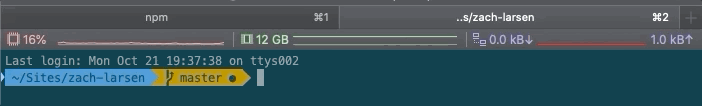
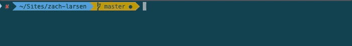

You know what sets apart a pro user from a regular user? Mastery over the keyboard shortcuts.

Alright! That’s not the only thing but it is undoubtedly a factor.

Shortcuts help you to be more productive and efficient with whatever tool you use. Imagine if you saw someone right-click to copy and paste, how would you feel about it?

Mac terminal is not an exception. There are certain Mac terminal shortcuts that every user must know and practice.

Trust me; once you master these shortcuts, you’ll notice how good you are with using the Mac command line.

1. **Tab**

	

	This is the Mac shortcut that you cannot live without. It saves me so much time and mental RAM.

	Just start typing a command, filename, directory name or even command options and hit the tab key. It will either automatically complete what you were typing or it will show all the possible results for you.

	If all you remember from this list is this shortcut, I'll be happy.

2. **Ctrl + C**

	

	These are the keys you should press in order to break out of a command or process on a terminal. This will stop a running program immediately.

	If you want to stop using a program running in the foreground, just press this key combination.

3. **Ctrl + Z**

	

	This shortcut will send a running program in the background. Normally, you can achieve this before running the program using the & option but if you forgot to do that, use this key combination.

4. **Ctrl + D**

	

	This keyboard shortcut will log you out of the terminal you are currently using. Use this command to close an SSH connection. If you are using a terminal directly, the application will be closed immediately.

	Consider it equivalent to the ‘exit’ command.

5. **Ctrl + L**

	

	How do you clear your terminal screen? Use the clear command.

	Instead of typing out CLEAR, you can simply use Ctrl + L to clear the terminal. Fast and simple.

6. **Ctrl + A**

	

	This shortcut will move the cursor to the beginning of the line.

	I use this all the time. I usually have a really long command that I paste into the terminal but want to modify just a little bit. Using the arrow keys is slow and tedious.

	This is where Ctrl + A saves the day.

7. **Ctrl + E**

	

	This shortcut is the opposite of Ctrl + A. Ctrl + E sends you to the end of the line, whereas Ctrl + A sends the cursor to the beginning of the line.

8. **Ctrl + U**

	

	Did you end up typing a bad command? Instead of slamming the backspace for a week to discard the current command, use the Ctrl + U shortcut in the Linux terminal. This shortcut erases everything from the current cursor position to the beginning of the line.

	You can also use Ctrl + C if you do not want to remember Ctrl + U.

9. **Ctrl + K**

	

	This one is the opposite of the Ctrl + U shortcut. The only difference is that instead of the beginning of the line, it erases everything from the current cursor position to the end of the line.

10. **Ctrl + W**

	

	We just talked about erasing text to the end or start of the line. Obviously there are words inbetween the end and start of the line. Welcome the Ctrl + W shortcut.

	The Ctrl + W shortcut, erases the word preceding the cursor position. If the cursor is on a word itself, it will erase all letters from the cursor position to the beginning of the word.

11. **Ctrl + Y**

	

	This will paste the erased text from Ctrl + W, Ctrl + U and Ctrl + K shortcuts. This is useful when you erased the wrong string or if you need to use the erased string elsewhere.

12. **Ctrl + P**

	

	You can use this shortcut to view the previous command. You can press it repeatedly to keep on going back in the command history.

13. **Ctrl + N**

	

	Just like Cmd + Tab and Cmd + ~ work together, you can use this shortcut in conjugation with Ctrl + P. Ctrl + N displays the next command. If you are viewing previous commands with Ctrl + P, you can use Ctrl + N to navigate back and forth.

14. **Bonus Shortcut: Ctrl + R**

	

	You made it to the end. This is a shortcut that I learned a few months ago, and use on a daily basis. You typed some command but cannot remember what it was exactly? Enter Ctrl + R.

	This keyboard shortcut performs a search in your command history. Just press Ctrl + R and start typing. It will show the last command that matches the string you typed. The power of this shortcut is that the typed string could be anywhere in the command.

	If you want to see more commands for the same search string, just keep pressing Ctrl + R.

	You can press Esc to come out of the search with the last search result or enter to run the command selected.

	Seriously, remember this shortcut and you won't be sorry.
